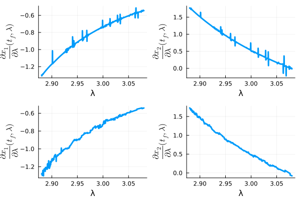

# CTDiffFlow

Documentation for [CTDiffFlow](https://github.com/control-toolbox/CTDiffFlow.jl).


## Introduction


This GitHub repository tests the different possibility in Julia for computing the derivative of a flow.

We numerical resluts are obtained on the following example $\lambda = (1,2)$


```math
(IVP)\left\{\begin{array}{l}
\dot{x}_1 = \lambda_1x_1\\
\dot{x}_2 = \lambda_2x_2\\
\dot{x}_3 = (\lambda_1-\lambda_2)x_3\\
x_1(0) = \lambda_2\\
x_2(0) = 1\\
x_3(0) = 1.
\end{array}
\right.
```

So the flow is

```math
x(t,0,x_0(\lambda),\lambda) =  \begin{pmatrix}
\exp(\lambda_1t) & 0 & 0\\
 0 & \exp(\lambda_2t) & 0\\
0 & 0 &  \exp((\lambda_1-\lambda_2)t)
\end{pmatrix}x_0(\lambda)
=\begin{pmatrix}
\lambda_2\exp(\lambda_1t)\\ \exp(\lambda_2t)\\ \exp((\lambda_1-\lambda_2)t)
\end{pmatrix}.
```

And the dérivatives are 

```math
\frac{\partial x}{\partial x_0}(t,t_0,x_0(\lambda),\lambda) = 
 \begin{pmatrix}
\exp(\lambda_1t) & 0 & 0\\
 0 & \exp(\lambda_2t) & 0\\
0 & 0 &  \exp((\lambda_1-\lambda_2)t)
\end{pmatrix},
```
and 

```math
\frac{\partial x}{\partial \lambda}(t,t_0,x_0(\lambda),\lambda) = 
 \begin{pmatrix}
\lambda_2t\exp(\lambda_1t) & \exp(\lambda_1t)\\
 0 & t\exp(\lambda_2t) \\
 t\exp((\lambda_1-\lambda_2)t) &  -t\exp((\lambda_1-\lambda_2)t)
\end{pmatrix}.
```
## END

<figure>

<figcaption> Derivative computing by finite differences. $t_f=20, \lambda$ ranging from 2.88 to 3.08, $Tol=RelTol=AbsTol=10^{-4}$. Top graphs is for  $\delta\lambda=4Tol$ and bottom graphs for $\delta\lambda=\sqrt{Tol}$. The numerical integrattion is done with Tsit5().
</figcaption>
</figure>


## Reproducibility

```@setup main
using Pkg
using InteractiveUtils
using Markdown

# Download links for the benchmark environment
function _downloads_toml(DIR)
    link_manifest = joinpath("assets", DIR, "Manifest.toml")
    link_project = joinpath("assets", DIR, "Project.toml")
    return Markdown.parse("""
    You can download the exact environment used to build this documentation:
    - 📦 [Project.toml]($link_project) - Package dependencies
    - 📋 [Manifest.toml]($link_manifest) - Complete dependency tree with versions
    """)
end
```

```@example main
_downloads_toml(".") # hide
```

```@raw html
<details style="margin-bottom: 0.5em; margin-top: 1em;"><summary>ℹ️ Version info</summary>
```

```@example main
versioninfo() # hide
```

```@raw html
</details>
```

```@raw html
<details style="margin-bottom: 0.5em;"><summary>📦 Package status</summary>
```

```@example main
Pkg.status() # hide
```

```@raw html
</details>
```

```@raw html
<details style="margin-bottom: 0.5em;"><summary>📚 Complete manifest</summary>
```

```@example main
Pkg.status(; mode = PKGMODE_MANIFEST) # hide
```

```@raw html
</details>
```
