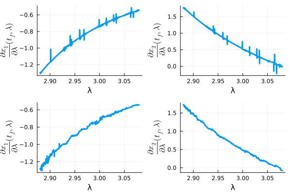

# CTDiffFlow

Documentation for [CTDiffFlow](https://github.com/control-toolbox/CTDiffFlow.jl).


## Introduction


This GitHub repository tests the different possibility in Julia for computing the derivatives of a flow. Let's the following ordinary differential equation

```math
(IVP)\left\{\begin{array}{l}
\dot{x} = f(t,x(t))\\
x(t_0) = x_0\\
\end{array}
\right.
```

where $f$ is a smooth function. We denote $x(t,t_0,x_0)$ the flow of this $(IVP)$ at time $t$.  
The objective is to compute the derivatives at the final time $t_f$ with respect to the initial condition, that is 
```math
\frac{\partial x}{\partial x_0}(t_f,t_0,x_0)
```

It's well know that the finite differences on the numerical flow for approximating this derivative, known in the literature as the External Numerical Differentiation[^1], doesn't give good results. For example, if we compute des derivative with respect ti the paramater $\lambda$ ov the Brusselator example[^2]

$$(IVP)\left\{\begin{array}{l}
\dot{x}_1 = 1+x_1^2x_2-(\lambda+1)x_1\\
\dot{x}_2 = \lambda x_1-x_1^2x_2\\
x_1(0) = 1.3\\
x_2(0) = \lambda.
\end{array}
\right.$$

We obtain

```@raw html
<figure>

<figcaption> Derivative computing by finite differences. $t_f=20, \lambda$ ranging from 2.88 to 3.08, $Tol=RelTol=AbsTol=10^{-4}$. Top graphs is for  $\delta\lambda=4Tol$ and bottom graphs for $\delta\lambda=\sqrt{Tol}$. The numerical integrattion is done with Tsit5().
</figcaption>
</figure>
```

The other possilities for computing this derivative are
* to integrate the variational equation

```math
\def\dx{\delta x}
\def\ddx{\dot{\wideparen{\delta x}}}
{VAR\ivpref\label{varlambda}})
\left\{\begin{array}{l}
\ddx(t)=A(t)\dx(t)\\
\dx(t_0)=x_0,
\end{array}\right.
```

* to use the automatic differentiation on the flow, what is known also in the literature as the Internal Numerical Differentiation[^1].
to do : explain that it's necessary not to differentate the step h(p) and the "number of iterations for solving the non linear equations in case of implicit method.

So the following scheme commutes

<!--
```math
\begin{equation*}
\begin{CD}
\textrm{Problème de contrôle optimal} @>{\textrm{Condition nécessaire}}>> \textrm{Problème aux deux bouts}\\
@V{\textrm{Discrétisation}}VV      @VV{\textrm{Discrétisation}}V\\
\textrm{Problème d'optimisation} @>{\textrm{Condition nécessaire}}>>\textrm{\'Equation non linéaire}
\end{CD}
```
-->


[^1]: H. G. Bock, *Numerical treatment of inverse problems in chemical reaction kinetics*, in K. H. Ebert, P. Deuflhard, and W. Jäger, editors, *Modelling of Chemical Reaction Systems*, volume 18 of *Springer Series in
Chemical Physics*, pages 102–125. Springer, Heidelberg, 1981.

[^2]: E. Hairer, S.P. N\o rsett and G. Wanner, *Solving Ordinary Differential Equations I, Nonstiff Problems*, second edition, *Springer Serie in Computational Mathematics, Springer-Verlag*, Vol. 8, 1993, page 201

## First numerical results
### Test example
The numerical results are obtained on the following example $\lambda = (1,2)$

```math
(IVP)\left\{\begin{array}{l}
\dot{x}_1 = \lambda_1x_1\\
\dot{x}_2 = \lambda_2x_2\\
\dot{x}_3 = (\lambda_1-\lambda_2)x_3\\
x_1(0) = \lambda_2\\
x_2(0) = 1\\
x_3(0) = 1.
\end{array}
\right.
```

So the flow is

```math
x(t,0,x_0(\lambda),\lambda) =  \begin{pmatrix}
\exp(\lambda_1t) & 0 & 0\\
 0 & \exp(\lambda_2t) & 0\\
0 & 0 &  \exp((\lambda_1-\lambda_2)t)
\end{pmatrix}x_0(\lambda)
=\begin{pmatrix}
\lambda_2\exp(\lambda_1t)\\ \exp(\lambda_2t)\\ \exp((\lambda_1-\lambda_2)t)
\end{pmatrix}.
```

And the dérivative with respect to the initial condition is 


```math
\frac{\partial x}{\partial x_0}(t,t_0,x_0(\lambda),\lambda) = 
 \begin{pmatrix}
\exp(\lambda_1t) & 0 & 0\\
 0 & \exp(\lambda_2t) & 0\\
0 & 0 &  \exp((\lambda_1-\lambda_2)t)
\end{pmatrix},
```

<!==
```math
\frac{\partial x}{\partial \lambda}(t,t_0,x_0(\lambda),\lambda) = 
 \begin{pmatrix}
\lambda_2t\exp(\lambda_1t) & \exp(\lambda_1t)\\
 0 & t\exp(\lambda_2t) \\
 t\exp((\lambda_1-\lambda_2)t) &  -t\exp((\lambda_1-\lambda_2)t)
\end{pmatrix}.
```
-->

### Numerical results For fixed steps

```julia
include("../../test/test_ForwardDiff.jl")
df_sol = DataFrame(adaptive=Bool[], VAR_IND=String[], internalnorm=String[], norm_∞_error=Real[], norm_∞_diff=Real[], time_steps=Vector[])

test_FD!(df_sol,fun_lin, tspan, x0, λ, sol_∂xO_flow,false)

println(df_sol)
```

### Numerical results For variable steps

#### with my_norm


```julia
df_sol = DataFrame(adaptive=Bool[], VAR_IND=String[], internalnorm=String[], norm_∞_error=Real[], norm_∞_diff=Real[], time_steps=Vector[])


# with my_norm the diagram switches 
sse(x::Number) = x^2
sse(x::ForwardDiff.Dual) = sse(ForwardDiff.value(x)) #+ sum(sse, ForwardDiff.partials(x))
totallength(x::Number) = 1
function totallength(x::ForwardDiff.Dual)
  totallength(ForwardDiff.value(x)) #+ sum(totallength, ForwardDiff.partials(x))
end
totallength(x::AbstractArray) = sum(totallength, x)
function my_norm(u, t)
  return sqrt(sum(x -> sse(x), u) / totallength(u))
end

test_FD!(df_sol,fun_lin, tspan, x0, λ, sol_∂xO_flow,true,internalnorm=my_norm)
println(df_sol)

```

## Reproducibility

```@setup main
using Pkg
using InteractiveUtils
using Markdown

# Download links for the benchmark environment
function _downloads_toml(DIR)
    link_manifest = joinpath("assets", DIR, "Manifest.toml")
    link_project = joinpath("assets", DIR, "Project.toml")
    return Markdown.parse("""
    You can download the exact environment used to build this documentation:
    - 📦 [Project.toml]($link_project) - Package dependencies
    - 📋 [Manifest.toml]($link_manifest) - Complete dependency tree with versions
    """)
end
```

```@example main
_downloads_toml(".") # hide
```

```@raw html
<br>
```

!!! details "ℹ️ Version info"

    ```@example main
    versioninfo() # hide
    ```

!!! details "📦 Package status"

    ```@example main
    Pkg.status() # hide
    ```

!!! details "📚 Complete manifest"

    ```@example main
    Pkg.status(; mode = PKGMODE_MANIFEST) # hide
    ```
